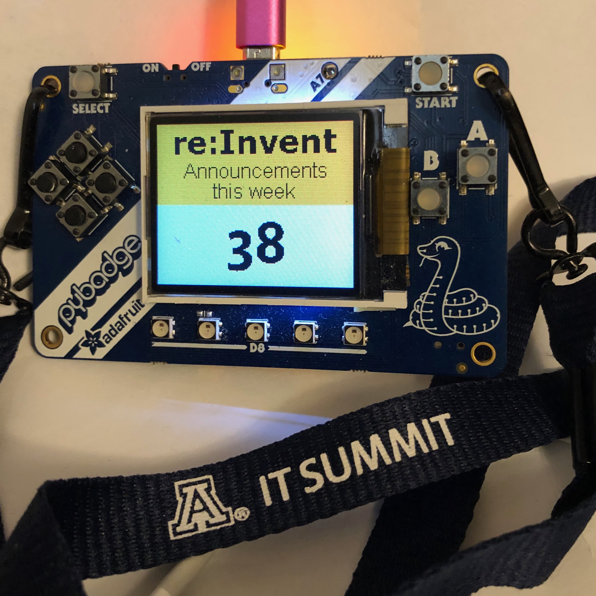

# pybadge-reinvent-2019
Mark's pybadge code for re:Invent 2019

The goal of this project is to display a count of the AWS service announcements during the week of re:Invent. 

The physical display is an [Adafruit pyBadge](https://www.adafruit.com/product/4200) with a code project running on it inspired by the [pyBadge tutorial](https://learn.adafruit.com/pybadger-event-badge). 

The data for the project is pulled from the [AWS announcement](https://aws.amazon.com/new/) RSS feed found at https://aws.amazon.com/about-aws/whats-new/recent/feed/

The data is polled hourly by a lambda function, which stores all the announcements, and updates a counter.

A second lambda function and API gateway serve as the endpoint for the pyBadge to fetch the stats from.

